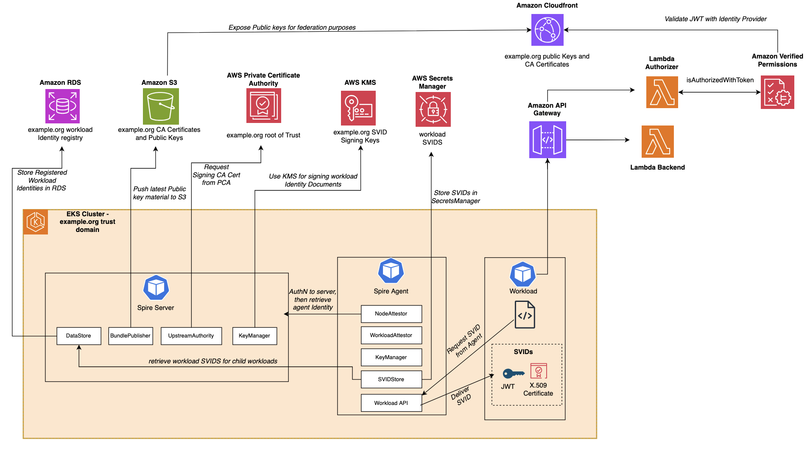
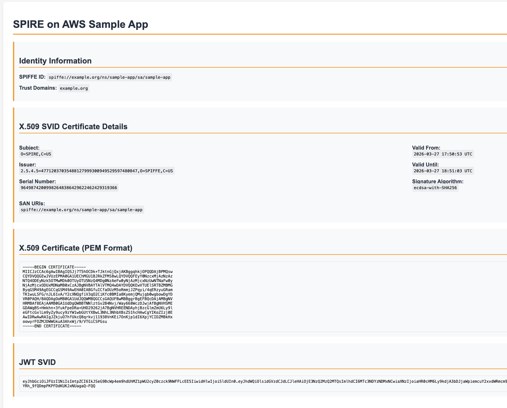
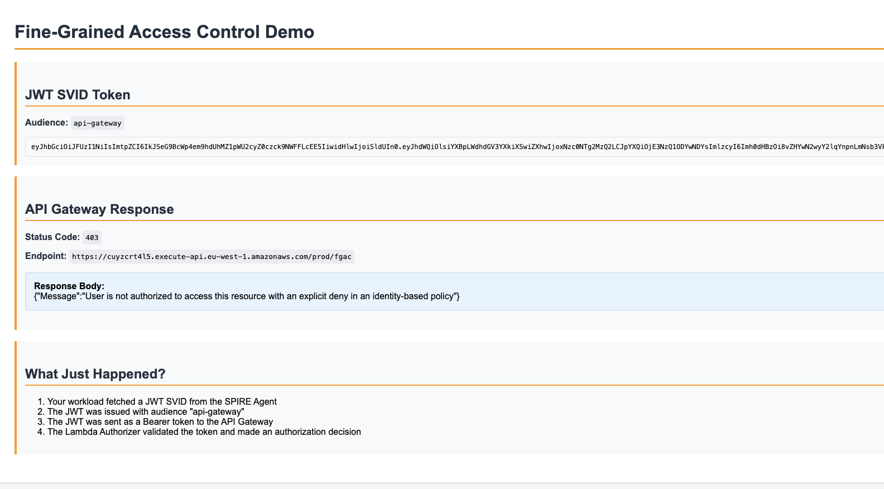
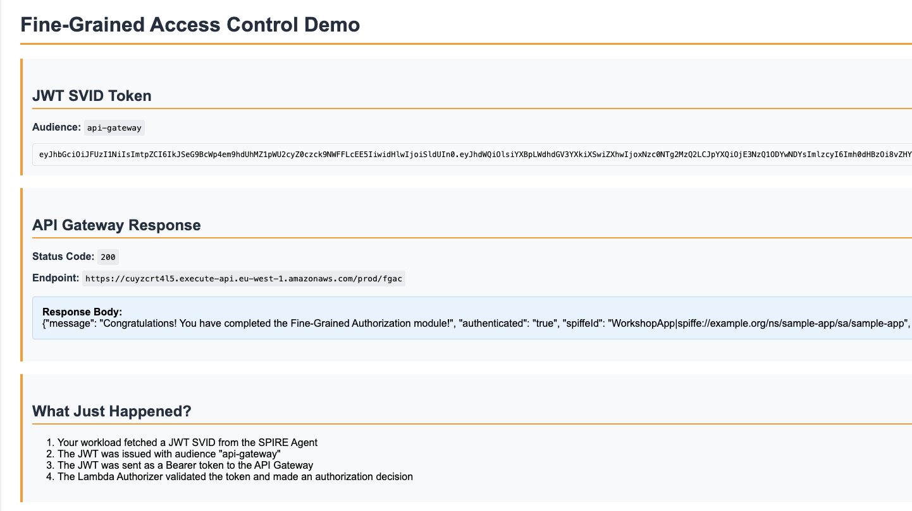

# SPIRE with AWS Managed Services Sample


> **Note:** This project is for demonstration purposes only and is not intended for production use. It is designed to show how you can leverage AWS managed services when running SPIRE on AWS.

This repository contains the infrastructure and Kubernetes manifests for deploying [SPIRE](https://spiffe.io/docs/latest/spire-about/) on Amazon EKS with AWS managed service integrations.

[SPIRE](https://spiffe.io/docs/latest/spire-about/) is the reference implementation of the [SPIFFE](https://spiffe.io/) (Secure Production Identity Framework for Everyone) specification, providing cryptographic workload identities to software systems in dynamic and heterogeneous environments. By default, SPIRE handles key management, data storage, certificate authority, and trust bundle distribution internally. 

A sample workload is provisioned that displays the workload's SPIFFE identity (X.509 and JWT SVIDs) and demonstrates the end-to-end authorization flow through API Gateway and Verified Permissions. The stack will provision also provision a Cognito User Pool and test user to access the web application in addition to the infrastructure supporting the SPIRE system.


## What it does

The default SPIRE deployment handles key management, data storage, and certificate authority functions internally. This repo enables you to offload those functions to AWS managed services:

| SPIRE Component | AWS Service | Benefit |
|---|---|---|
| Key Manager | AWS KMS | Private keys that never leave KMS HSMs unencrypted |
| Datastore | Amazon Aurora PostgreSQL | A global-scale relational database service built for the cloud with PostgreSQL compatibility |
| Certificate Authority | AWS Private CA | HSM-backed root of trust, managed CRL/OCSP |
| Trust Bundle Publisher | Amazon S3 + CloudFront | Global bundle distribution decoupled from SPIRE server |
| SVID Store (Agent) | AWS Secrets Manager | Push SVIDs to serverless/ephemeral workloads |




## Repository structure

```
spiffe.yaml              # Base CloudFormation stack (VPC, EKS, S3/CloudFront, PCA, RDS,
                         #   Verified Permissions, API Gateway, Cognito)
companion-stack.yaml     # Companion CloudFormation stack (CodeBuild project that configures
                         #   SPIRE on EKS)
upload-templates.sh      # Script to create an S3 bucket and upload K8s templates
templates/               # Kubernetes manifests applied by the CodeBuild job
  kustomization.yaml
  install-alb-controller.sh
  spire/               # SPIRE server, agent, CSI driver, controller manager
  crd/                 # SPIRE CRDs
  crd-rbac/            # RBAC for the SPIRE controller manager
  sample-app/          # Sample workload with X.509/JWT SVID retrieval and fine-grained authz
```

## Deployment

### Prerequisites

- AWS CLI configured with appropriate credentials
- An AWS account with permissions to create EKS, RDS, PCA, KMS, S3, CloudFront, Cognito, and Lambda resources

### 1. Deploy the base infrastructure

The base stack template exceeds 51 KB, so it must be deployed via an S3 bucket:

```bash
REGION=<your-region>
ACCOUNT_ID=$(aws sts get-caller-identity --query Account --output text)
BUCKET=spire-templates-${ACCOUNT_ID}-${REGION}

aws s3api create-bucket --bucket $BUCKET --region $REGION \
  --create-bucket-configuration LocationConstraint=$REGION

aws cloudformation deploy \
  --template-file spiffe.yaml \
  --stack-name spiffe \
  --capabilities CAPABILITY_NAMED_IAM \
  --region $REGION \
  --s3-bucket $BUCKET \
  --parameter-overrides \
    DeployPCA=true \
    DeployRDS=true \
    DemoUserEmail=you@example.com
```

This creates the VPC, EKS cluster, S3/CloudFront, Aurora PostgreSQL (with RDS-managed master password and automatic rotation), Private CA, Verified Permissions, API Gateway (protected by AWS WAF with rate limiting), Cognito User Pool, and a CloudFront distribution for the sample app. Set `DeployPCA=false` or `DeployRDS=false` to skip those resources.

### 2. Upload the K8s templates

```bash
./upload-templates.sh --region <your-region>
```

### 3. Deploy the companion stack

```bash
aws cloudformation deploy \
  --template-file companion-stack.yaml \
  --stack-name spiffe-companion \
  --capabilities CAPABILITY_NAMED_IAM \
  --region <your-region> \
  --parameter-overrides \
    TemplateBucketName=spire-templates-<account-id>-<region> \
    DeployPCA=true \
    DeployRDS=true \
    DeployKMS=true \
    DeployVerifiedPermissions=true
```

The `DeployPCA` and `DeployRDS` flags must match what you set on the base stack.

### 4. Run the CodeBuild job

```bash
aws codebuild start-build \
  --project-name spiffe-companion-setup \
  --region <your-region>
```

## Accessing the application

The sample app is protected by Cognito authentication and served via CloudFront (HTTPS).

### 1. Get the CloudFront URL

```bash
aws cloudformation describe-stacks \
  --stack-name spiffe \
  --region <your-region> \
  --query 'Stacks[0].Outputs[?OutputKey==`AppCloudFrontDomain`].OutputValue' \
  --output text
```

### 2. Get the demo user credentials

```bash
aws secretsmanager get-secret-value \
  --secret-id spiffe-demo-user-password \
  --region <your-region> \
  --query 'SecretString' \
  --output text
```

### 3. Log in and view SPIFFE identity

Open `https://<cloudfront-domain>/` in your browser. Sign in with the demo user email and password. After authentication, you'll see the app's SPIFFE ID, X.509 certificate details, and a JWT SVID.



### 4. Test fine-grained access control

Open `https://<cloudfront-domain>/fgac` to test the authorization flow. This endpoint fetches a JWT SVID and sends it to the API Gateway, where a Lambda authorizer validates it against Amazon Verified Permissions.

On first access you should see an explicit deny because the default Cedar policy forbids all `spiffe://example.org/*` identities.



### 5. Update the Cedar policy

To allow access, update the policy in the [Amazon Verified Permissions console](https://console.aws.amazon.com/verifiedpermissions/):

1. Select the policy store created by the stack
2. Select the existing policy and click Edit
3. Replace the policy statement with:

```cedar
permit(
    principal,
    action,
    resource
)
when {
    principal has sub &&
    principal.sub like "spiffe://example.org/*"
};
```

4. Save the policy and refresh `https://<cloudfront-domain>/fgac`



## Configuration options

Both stacks share configuration flags that allow you to choose which managed service resources are provisioned. Use consistent values across base and companion stack:

| Parameter | Default | Base Stack | Companion Stack | Description |
|---|---|---|---|---|
| `DeployPCA` | `true` | Creates the Private CA (short-lived mode) | Activates PCA and configures SPIRE UpstreamAuthority | Use AWS Private CA as upstream authority |
| `DeployRDS` | `true` | Creates Aurora PostgreSQL cluster | Creates DB user and configures SPIRE DataStore | Use Aurora PostgreSQL as datastore |
| `DeployKMS` | `true` | — | Configures SPIRE KeyManager | Use AWS KMS for SVID signing |
| `DeployVerifiedPermissions` | `true` | Creates policy store, API Gateway, Lambdas | Deploys sample app authz module | Fine-grained authorization with Cedar policies |
| `DemoUserEmail` | (required) | Creates Cognito user | — | Email for the demo user |
| `SpireVersion` | `1.14.0` | — | Sets SPIRE container image tag | SPIRE version |


> **Note:** This sample uses an OIDC discovery document uploaded to S3/CloudFront tied to the CloudFront distribution name. If you have your own domain, use the [SPIRE OIDC Discovery Provider](https://github.com/spiffe/spire/blob/main/support/oidc-discovery-provider/README.md) with your own domain for JWKS publishing.

## Learn more

- [SPIFFE Documentation](https://spiffe.io/docs/latest/)
- [SPIRE on Kubernetes Quickstart](https://spiffe.io/docs/latest/try/getting-started-k8s/)
- [AWS KMS SPIRE Plugin](https://github.com/spiffe/spire/blob/main/doc/plugin_server_keymanager_aws_kms.md)
- [AWS PCA SPIRE Plugin](https://github.com/spiffe/spire/blob/main/doc/plugin_server_upstreamauthority_aws_pca.md)
- [S3 Bundle Publisher Plugin](https://github.com/spiffe/spire/blob/main/doc/plugin_server_bundlepublisher_aws_s3.md)
- [Secrets Manager SVIDStore Plugin](https://github.com/spiffe/spire/blob/main/doc/plugin_agent_svidstore_aws_secretsmanager.md)

## License

This project is licensed under the MIT-0 License. See the [LICENSE](LICENSE) file for details.
